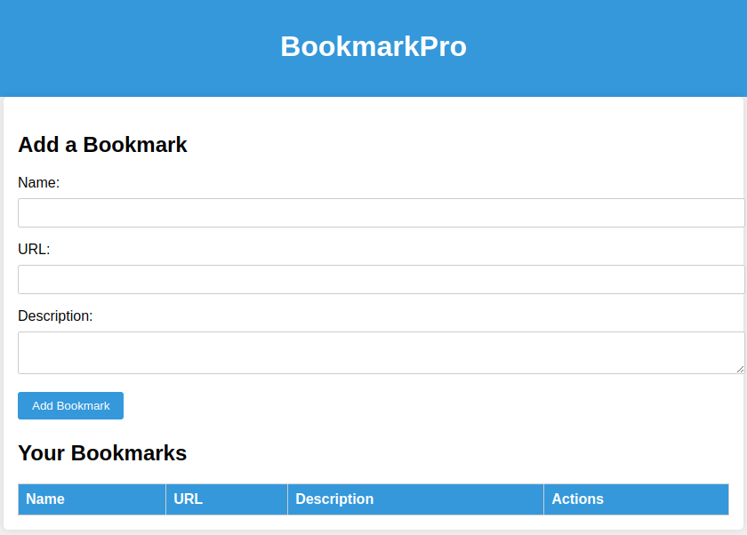
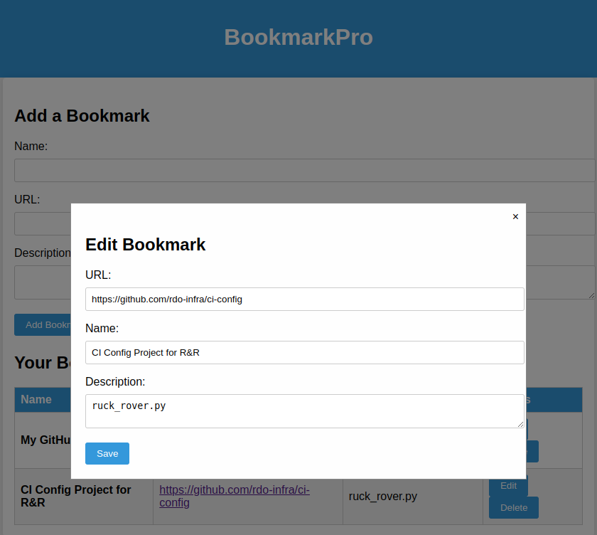

# Bookmark

bookmark app is a simple web application that allows you to manage your bookmarks efficiently. With bookmark app, you can add, edit, and delete bookmarks with ease.

## Features

- **Add Bookmarks:** Easily add new bookmarks by providing a URL, a name, and an optional description.

- **Edit Bookmarks:** Edit the details of existing bookmarks, including the URL, name, and description.

- **Delete Bookmarks:** Remove bookmarks you no longer need from your list.

## Getting Started

To get bookmark app up and running, follow these steps:

### Prerequisites

Before you begin, make sure you have the following installed on your system:

- Node.js and npm (Node Package Manager)

### Installation

1. Clone this repository to your local machine:

```bash
git clone https://github.com/your-username/bookmark-pro.git
cd bookmark-pro
npm install
npm start
```

This will start the bookmark app server on port 3000. You can access the application by opening your web browser and navigating to http://localhost:3000/.



